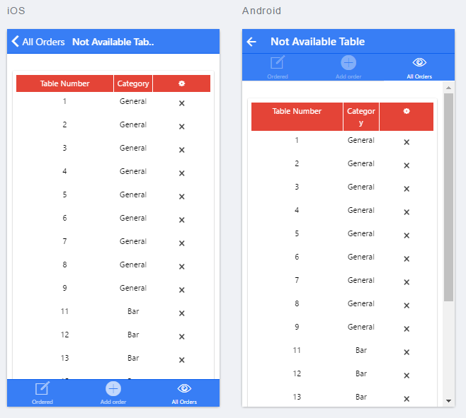
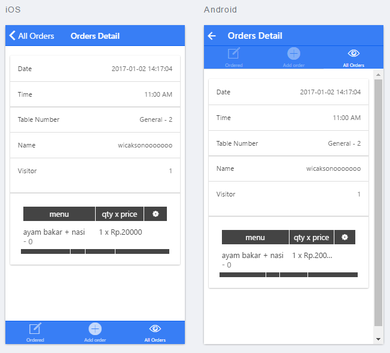
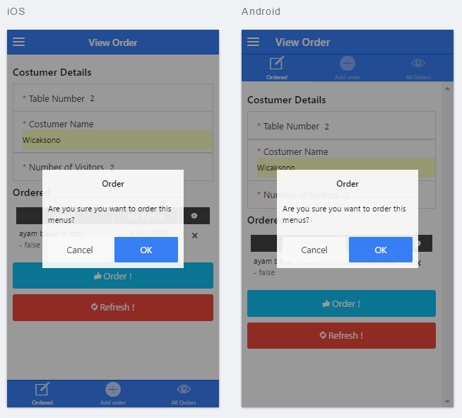
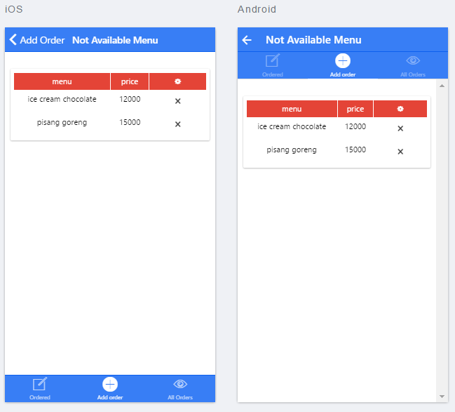
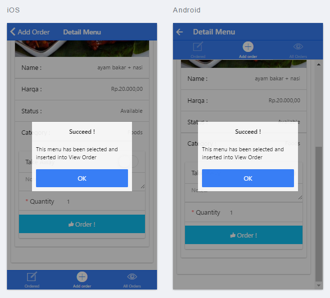
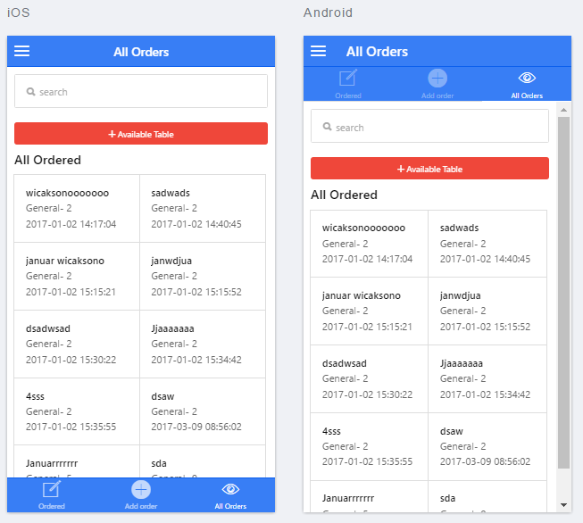

	<h2>Mobile Application Restaurant Order System Using Ionic Framework 1.3.x</h2>

This is my simple source code for build <a href="#">Mobile Hybrid Application Restaurant Order System Using Ionic Framework 1.3.x</a> when i was Internshiped at <a href="https://www.folarium.co.id/home">CV. Folarium Technomedia</a>

	<h2>Tools Used</h2>

<ul>
	<li>Chrome</li>
	<li>Xampp</li>
	<li>Sublime Text</li>
	<li>Git</li>
	<li>Bower</li>
	<li>PhoneGap</li>
</ul>

	<h2>References</h2>

<ul>
	<li><a href="https://ionicframework.com/">Ionic FrameWork</a></li>
</ul>
